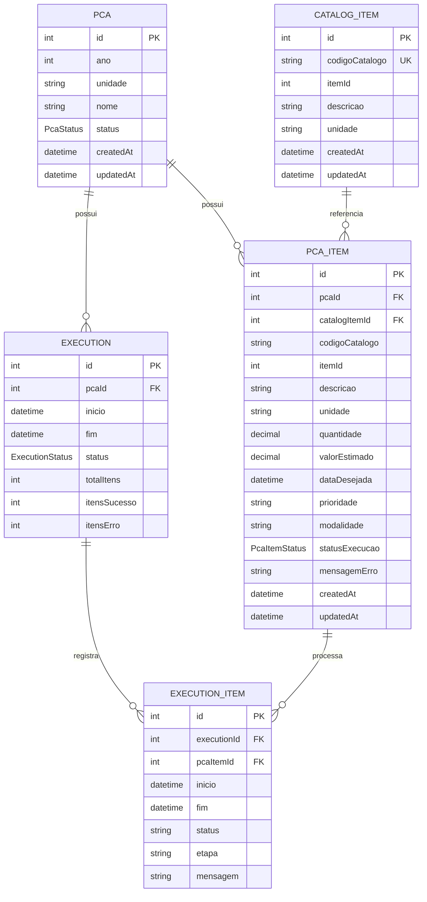

# PCA Auto — Diagrama de Entidade-Relacionamento (DER)

**Versão:** 0.9  
**Status:** representa o schema Prisma atual; modelo futuro permanece sujeito à validação  
**Data:** 2026-09-22

## 1. Objetivo

Registrar a modelagem relacional atualmente implementada e tornar explícitas as entidades, chaves e cardinalidades do PCA Auto.

## 2. DER

O diagrama abaixo representa o estado atual do schema Prisma.

## 3. Entidades

### PCA

Representa o plano em determinado ano, unidade e ciclo de processamento.

### PcaItem

Representa uma linha/necessidade processada dentro do PCA.

### CatalogItem

Cache local dos itens do catálogo consultados/utilizados.

### Execution

Representa um lote de execução.

### ExecutionItem

Representa o processamento de um item dentro de uma execução.

## 4. Relacionamentos

- Um PCA possui zero ou muitos PcaItems.
- Um CatalogItem pode ser referenciado por zero ou muitos PcaItems.
- Um PCA possui zero ou muitas Executions.
- Uma Execution possui um ou muitos ExecutionItems.
- Um PcaItem pode participar de várias ExecutionItems ao longo das execuções.

## 5. Integridade

O schema atual utiliza:

- chave primária autoincremental;
- chave única para CatalogItem.codigoCatalogo;
- chaves estrangeiras;
- índices para consultas por ano, status, PCA, código e execução;
- exclusão em cascata em relações de propriedade;
- SetNull para a referência opcional ao CatalogItem.

## 6. Estados atuais

### PcaStatus

- DRAFT
- READY
- RUNNING
- COMPLETED
- BLOCKED
- ERROR

### PcaItemStatus

- PENDING
- VALIDATED
- IN_PROGRESS
- COMPLETED
- ERROR

### ExecutionStatus

- CREATED
- RUNNING
- COMPLETED
- PARTIAL
- ERROR

## 7. Limitações conhecidas da modelagem atual

O schema atual ainda não representa explicitamente:

- usuários;
- unidades demandantes;
- gestores;
- ordenadores;
- versões de PCA;
- histórico completo de alterações;
- eventos de auditoria dedicados;
- origem/importação como entidade própria;
- regras/versionamento de validação;
- tenant/órgão como entidade multi-tenant.

Esses elementos não devem ser adicionados automaticamente antes de sua necessidade ser comprovada.

## 8. Evolução prevista

Quando o processo real for validado, o DER deverá ser revisado para refletir:

- origem da demanda;
- unidades e responsáveis;
- consolidação;
- revisão;
- auditoria;
- versionamento;
- permissões.

